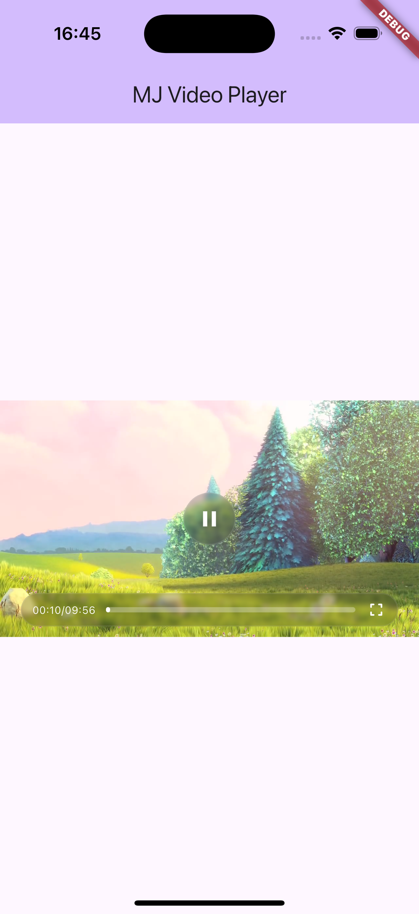
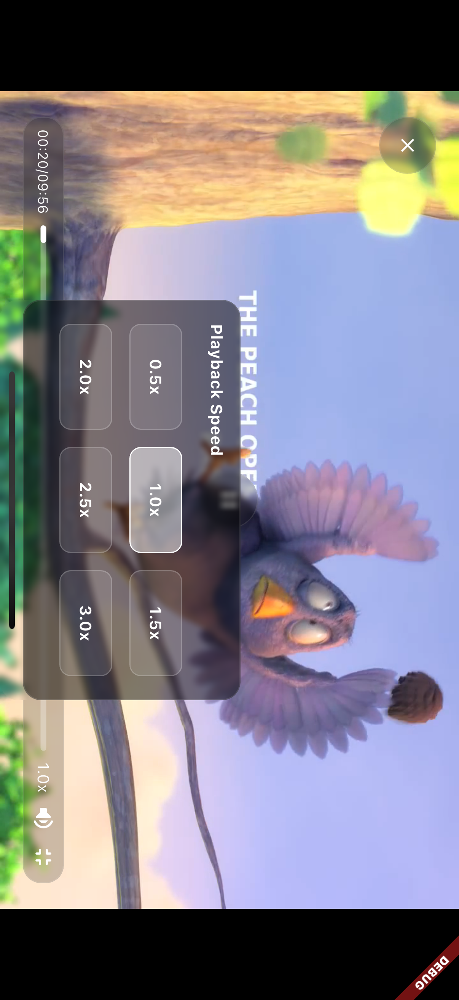
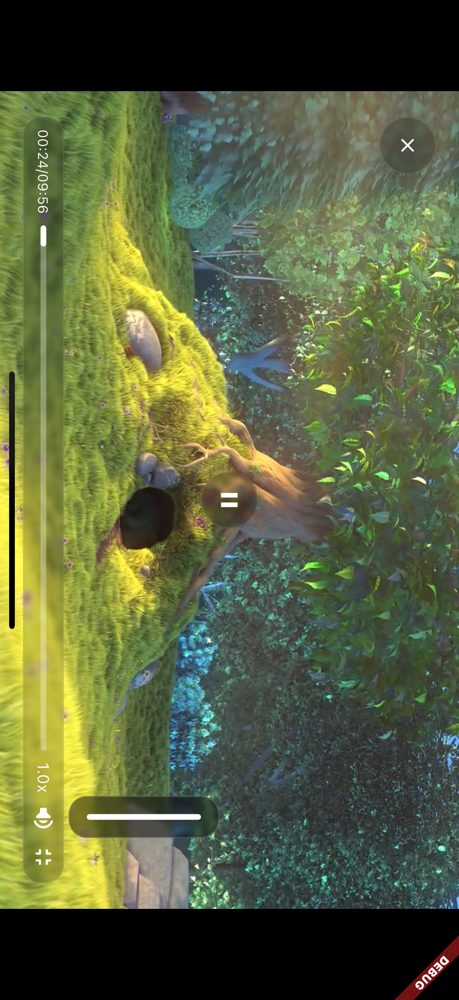

# MJ Video Player

[](https://pub.dev/packages/mj_video_player)
[](https://opensource.org/licenses/MIT)

A powerful and customizable video player for Flutter with enhanced controls and features built on top of the official `video_player` package.

## Screenshots

<p align="center">
  
  
  
  
</p>

## Features

- Support for network videos, local files, and asset videos
- Customizable control toolbar
- Multiple playback speeds (0.5x to 3x)
- Fullscreen mode support
- Loop playback
- Volume control
- Auto-play functionality
- Custom aspect ratio settings
- Initial playback configuration (position, volume, speed)

## Installation

Add this to your package's `pubspec.yaml` file:

```yaml
dependencies:
  mj_video_player: ^0.0.2
```

Then run:

```bash
flutter pub get
```

## Quick Start

### Basic Usage

```dart
import 'package:mj_video_player/mj_video_player.dart';
import 'package:flutter/material.dart';

class VideoPlayerExample extends StatefulWidget {
  @override
  _VideoPlayerExampleState createState() => _VideoPlayerExampleState();
}

class _VideoPlayerExampleState extends State<VideoPlayerExample> {
  late MJVideoPlayerController controller;

  @override
  void initState() {
    super.initState();

    // Create network video controller
    controller = MJVideoPlayerController.network(
      "https://sample-videos.com/zip/10/mp4/SampleVideo_1280x720_1mb.mp4",
      autoPlay: true,
      loop: true,
    );
  }

  @override
  void dispose() {
    controller.dispose();
    super.dispose();
  }

  @override
  Widget build(BuildContext context) {
    return Scaffold(
      appBar: AppBar(title: Text('MJ Video Player')),
      body: Center(
        child: MJVideoPlayer(controller: controller),
      ),
    );
  }
}
```

## Advanced Configuration

### Network Video Player

```dart
controller = MJVideoPlayerController.network(
  "https://sample-videos.com/video.mp4",
  showToolbar: true,          // Show control toolbar
  autoPlay: true,             // Auto play video
  loop: true,                 // Loop playback
  speeds: [0.5, 1, 1.5, 2, 2.5, 3], // Available playback speeds
  initialSpeed: 1.0,          // Initial playback speed
  initialVolume: 1.0,         // Initial volume (0.0 - 1.0)
  initialPosition: 10,        // Initial position in seconds
  aspectRation: 16 / 9,       // Video aspect ratio
);
```

### Asset Video Player

```dart
controller = MJVideoPlayerController.asset(
  "assets/videos/sample.mp4",
  autoPlay: false,
  showToolbar: true,
  aspectRation: 16 / 9,
);
```

### File Video Player

```dart
import 'dart:io';

controller = MJVideoPlayerController.file(
  File("/path/to/video/file.mp4"),
  autoPlay: true,
  loop: false,
);
```

## API Documentation

### MJVideoPlayerController

#### Constructors

| Constructor                                          | Description                               |
| ---------------------------------------------------- | ----------------------------------------- |
| `MJVideoPlayerController.network(String url, {...})` | Creates a network video player controller |
| `MJVideoPlayerController.asset(String asset, {...})` | Creates an asset video player controller  |
| `MJVideoPlayerController.file(File file, {...})`     | Creates a file video player controller    |

#### Parameters

| Parameter         | Type            | Default                    | Description                     |
| ----------------- | --------------- | -------------------------- | ------------------------------- |
| `showToolbar`     | `bool?`         | `true`                     | Whether to show control toolbar |
| `autoPlay`        | `bool?`         | `false`                    | Whether to auto play video      |
| `loop`            | `bool?`         | `false`                    | Whether to loop playback        |
| `speeds`          | `List<double>?` | `[0.5, 1, 1.5, 2, 2.5, 3]` | Available playback speeds       |
| `initialSpeed`    | `double?`       | `1.0`                      | Initial playback speed          |
| `initialVolume`   | `double?`       | `1.0`                      | Initial volume (0.0 - 1.0)      |
| `initialPosition` | `double?`       | `0`                        | Initial position in seconds     |
| `aspectRation`    | `double?`       | `16/9`                     | Video aspect ratio              |

#### Methods

| Method                      | Description               |
| --------------------------- | ------------------------- |
| `init()`                    | Initialize the player     |
| `play()`                    | Start playback            |
| `pause()`                   | Pause playback            |
| `stop()`                    | Stop playback             |
| `seekTo(Duration position)` | Seek to specific position |
| `setSpeed(double speed)`    | Set playback speed        |
| `setVolume(double volume)`  | Set volume                |
| `toggleFullscreen()`        | Toggle fullscreen mode    |
| `toggleToolbar()`           | Toggle toolbar visibility |
| `dispose()`                 | Release resources         |

#### Properties

| Property        | Type       | Description                        |
| --------------- | ---------- | ---------------------------------- |
| `isInitialized` | `bool`     | Whether the player is initialized  |
| `isPlaying`     | `bool`     | Whether video is currently playing |
| `isFullscreen`  | `bool`     | Whether in fullscreen mode         |
| `duration`      | `Duration` | Total video duration               |
| `position`      | `Duration` | Current playback position          |
| `aspectRatio`   | `double`   | Video aspect ratio                 |

## Complete Example

```dart
import 'package:mj_video_player/mj_video_player.dart';
import 'package:flutter/material.dart';

void main() {
  runApp(MyApp());
}

class MyApp extends StatelessWidget {
  @override
  Widget build(BuildContext context) {
    return MaterialApp(
      title: 'MJ Video Player Demo',
      theme: ThemeData(primarySwatch: Colors.blue),
      home: VideoPlayerDemo(),
    );
  }
}

class VideoPlayerDemo extends StatefulWidget {
  @override
  _VideoPlayerDemoState createState() => _VideoPlayerDemoState();
}

class _VideoPlayerDemoState extends State<VideoPlayerDemo> {
  late MJVideoPlayerController controller;

  @override
  void initState() {
    super.initState();

    controller = MJVideoPlayerController.network(
      "https://commondatastorage.googleapis.com/gtv-videos-bucket/sample/BigBuckBunny.mp4",
      showToolbar: true,
      autoPlay: true,
      loop: true,
      speeds: [0.5, 1, 1.5, 2, 2.5, 3],
      initialSpeed: 1.0,
      initialVolume: 1.0,
      aspectRation: 16 / 9,
    );
  }

  @override
  void dispose() {
    controller.dispose();
    super.dispose();
  }

  @override
  Widget build(BuildContext context) {
    return Scaffold(
      appBar: AppBar(
        title: Text('MJ Video Player Demo'),
      ),
      body: Column(
        children: [
          // Video Player
          Container(
            width: double.infinity,
            child: MJVideoPlayer(controller: controller),
          ),

          // Control Buttons
          Padding(
            padding: EdgeInsets.all(16),
            child: Row(
              mainAxisAlignment: MainAxisAlignment.spaceEvenly,
              children: [
                ElevatedButton(
                  onPressed: () => controller.play(),
                  child: Text('Play'),
                ),
                ElevatedButton(
                  onPressed: () => controller.pause(),
                  child: Text('Pause'),
                ),
                ElevatedButton(
                  onPressed: () => controller.toggleFullscreen(),
                  child: Text('Fullscreen'),
                ),
              ],
            ),
          ),
        ],
      ),
    );
  }
}
```

## Platform Setup

### iOS Configuration

Add the following to `ios/Runner/Info.plist` for network video support:

```xml
<key>NSAppTransportSecurity</key>
<dict>
  <key>NSAllowsArbitraryLoads</key>
  <true/>
</dict>
```

### Android Configuration

Add internet permission to `android/app/src/main/AndroidManifest.xml`:

```xml
<uses-permission android:name="android.permission.INTERNET" />
```

## Important Notes

- Always call `controller.dispose()` in your widget's `dispose()` method to free up resources
- Make sure to handle video loading states appropriately in your UI
- Test video playback on actual devices for best performance assessment

## Contributing

Issues and pull requests are welcome. For major changes, please open an issue first to discuss what you would like to change.

## License

This project is licensed under the [MIT License](LICENSE).

## Links

- [GitHub Repository](https://github.com/maojiu-bb/mj_video_player)
- [Pub Package](https://pub.dev/packages/mj_video_player)
- [Issue Tracker](https://github.com/maojiu-bb/mj_video_player/issues)
